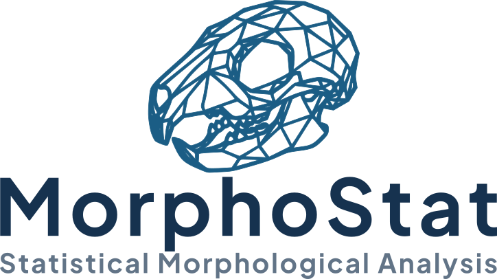

<p align="center">
  
</p>

# MorphoStat

<p align="center">
  
  
  
</p>

**MorphoStat** is a modern, interactive R Shiny application for statistical morphological analysis using geometric morphometrics. It provides a comprehensive suite of tools for analyzing landmark-based morphometric data with publication-ready visualizations.

## Features

### Data Input
- **Multiple file formats**: Morphologika (.txt), TPS (.tps), NTS (.nts), FCSV (3D Slicer)
- **Project save/load**: Save and restore complete analysis sessions (.rds)
- **Auto-detection**: Automatically detects 2D/3D landmark configurations

### Analysis Pipeline
- **Generalized Procrustes Analysis (GPA)**: Removes size, position, and rotation effects
- **Principal Component Analysis (PCA)**: Identifies major axes of shape variation
- **PERMANOVA**: Tests for significant shape differences between groups
- **PERMDISP**: Tests for homogeneity of group dispersions
- **Allometry Analysis**: Evaluates shape-size relationships
- **Pairwise Comparisons**: Multiple group comparisons with distance metrics

### Visualizations
- **PCA Plots**: 2D colored, black & white, and 3D scatter plots
- **Shape Deformations**: Mean, min, and max PC shape visualization
- **Procrustes Superimposition**: View all specimens or individual samples
- **Interactive 3D WebGL Views**: Rotate wireframes in full 3D morphospace using the mouse (Procrustes & PC Deformation)
- **Wireframe Diagrams**: Multiple anatomical views (dorsal, sagittal, coronal)
- **Statistical Plots**: Centroid size boxplots, allometry regression, eigenvalue scree plots
- **Outlier Detection**: Identify potential outliers based on Procrustes distance

### Customization
- **Custom group colors**: Assign specific colors to groups
- **Group renaming**: Rename groups for publication
- **Data spread visualization**: Confidence ellipses, convex hulls, density contours
- **Diagram transformations**: Flip and rotate shape visualizations
- **Export options**: PNG and SVG formats with customizable dimensions
- **Branded interface**: Custom logo displayed in the title bar and About section
- **Whisker representation**: Choose between IQR, Min/Max, Percentile, or Std Deviation for box plots *(v1.1)*
- **Significance bars**: Pairwise p-value / star annotations on statistical plots with t-test or Wilcoxon *(v1.1)*
- **Extended plot settings**: Custom titles, axis labels, themes, coordinate flip, transparency, and size controls *(v1.1)*

## Installation

### Prerequisites
Make sure you have R (>= 4.0.0) installed. You'll also need the following R packages:

```r
install.packages(c(
  "shiny",
  "shinydashboard", 
  "bslib",
  "shinyjs",
  "ggplot2",
  "DT",
  "colourpicker",
  "scatterplot3d",
  "rgl",
  "plotly"
))

# Bioconductor/specialized packages
install.packages("geomorph")
install.packages("RRPP")
install.packages("Morpho")
install.packages("vegan")
install.packages("rstatix")
```

### Running the App

1. Clone this repository:
```bash
git clone https://github.com/Dinuka0001/MorphoStat.git
cd MorphoStat
```

2. Open R or RStudio and run:
```r
shiny::runApp("App.R")
```

Or run directly:
```r
shiny::runApp("path/to/morphostat")
```

## Usage

### Quick Start

1. **Select input type**: Choose your data format (Morphologika, TPS, NTS, or FCSV)
2. **Upload data**: Use the file input to upload your landmark data
3. **Configure wireframe** (optional): Define landmark connections
4. **Run analysis**: Click "Run Analysis" to perform GPA, PCA, and statistical tests
5. **Explore results**: Navigate through tabs to view plots and statistics
6. **Export**: Download results, plots, or save the entire project

### Input File Formats

#### Morphologika Format (.txt)
```
[individuals]
10
[landmarks]
48
[dimensions]
3
[names]
Specimen_01
...
[labels]
Group_A
...
[rawpoints]
12.345 23.456 5.678
...
```

#### TPS Format (.tps)
```
LM=48
12.345 23.456
13.456 24.567
...
ID=Specimen_01
```

#### Wireframe Links
Define landmark connections as comma-separated pairs:
```
1,2, 2,3, 3,4, 4,5, 5,1
```

## Screenshots

*Coming soon*

## Statistical Methods

| Method | Purpose | Package |
|--------|---------|---------|
| GPA | Procrustes superimposition | geomorph |
| PCA | Shape variation analysis | geomorph |
| PERMANOVA | Group difference testing | vegan, RRPP |
| PERMDISP | Dispersion homogeneity | vegan |
| Allometry | Size-shape relationship | RRPP |

## Citation

If you use MorphoStat in your research, please cite:

```
Adasooriya, D. (2026). MorphoStat: An Interactive R Shiny Application for
Statistical Morphological Analysis. Version 1.1.0. © 2026 Dinuka Adasooriya.
```

Also cite the underlying R packages:
- Adams DC, Collyer ML, Kaliontzopoulou A. 2024. Geomorph: Software for geometric morphometric analyses. R package version 4.0.8.
- Oksanen J, et al. 2022. vegan: Community Ecology Package. R package version 2.6-4.

## Links

- **GitHub**: [https://github.com/Dinuka0001/MorphoStat](https://github.com/Dinuka0001/MorphoStat)
- **Online App**: [https://dinuka-morphostat.share.connect.posit.cloud/](https://dinuka-morphostat.share.connect.posit.cloud/)

---

## Version History

### v1.1.0 — April 2026

#### New Features

**Box Plot — Whisker Representation Control**
- Added a new *Whiskers Representation* selector for Centroid Size and Dispersion plots
- Four modes available: Default (1.5× IQR), Min/Max, Percentiles (5th–95th), and **Std Deviation (Mean ± SD)**
- Uses a statistically correct `stat_summary` approach — fully compatible with all ggplot2 versions

**Box Plot — Significance Bars**
- Added pairwise statistical significance annotations to Centroid Size and Dispersion plots
- Choose between *t-test* or *Wilcoxon* rank-sum test
- Label style options: star notation (`***`, `**`, `*`, `ns`) or exact p-values
- Controls for bracket spacing, tip length, and text size
- Significance bars carried through to downloaded plot files

**Box Plot — Expanded Aesthetics & Layout**
- Fill transparency, box line width, and box width sliders
- Point overlay controls: individual jitter width, alpha, and point size
- Custom axis labels and title for Centroid Size, Dispersion, and Eigenvalues plots
- Theme selector: Classic, Minimal, BW, Light
- Coordinate flip toggle
- Show/hide legend toggle

**Eigenvalues Plot — Enhancements**
- Customizable bar colour, cumulative line colour
- Bar transparency and width sliders
- Cumulative line width slider
- Theme selector + coordinate flip

**2D PCA Plot — Grid Lines Toggle**
- Fixed the *Show Grid Lines* checkbox to correctly show/hide grid lines on 2D scatter plots (both colour and black & white modes)
- Grid state is now preserved in downloaded PNG/SVG exports

#### Bug Fixes

- **SD whisker `[object Object]`**: Rewrote SD whisker logic using `stat_summary(fun.data = whisker_stat_fun(...), geom = "boxplot")` — the previous `aggregate()` matrix approach caused serialization errors in Shiny
- **Percentile whisker not rendering**: `geom_boxplot` was incorrectly passed `fun.data`, which it does not support; fixed to use `stat_summary` consistently across all whisker modes
- **PCA grid lines not toggling**: `morphostat_plot_theme()` sets `panel.grid.major.x = element_blank()` internally; overriding with `panel.grid.major` was insufficient — fixed by explicitly overriding `panel.grid.major.x` and `panel.grid.major.y` individually
- **Principal Component Analysis (PCA)** — 3D interactive (WebGL) wireframe
- **Downloaded PCA plots missing grid**: `apply_pca_download_theme()` used `theme_classic()` (no grid by default) with only a grid-removal branch — added a grid-addition branch that respects the UI checkbox
- **Centroid Size statistics showing raw variable names**: `aggregate()` formula interface was used with reactive values as column names, producing labels like `rv$centroid_size` in output — replaced with named data frame columns
- **Download buttons for statistical plots not working**: Handlers `download_stat_plot_png`, `download_stat_plot_svg`, and `download_all_stat_plots` were missing from the server; back-ported from backup


---

### v1.0.0 — January 2026 *(Initial Release)*

- Generalized Procrustes Analysis (GPA) with full landmark superimposition
- Principal Component Analysis (PCA) — 2D colour plot, 2D black & white
- Data spread overlays: confidence ellipses, convex hulls, 2D density contours
- PERMANOVA and PERMDISP group difference testing
- Allometry regression (log centroid size vs PC1)
- Pairwise group comparisons with distance metrics
- Centroid Size, Dispersion, Eigenvalues, and Allometry statistical plots
- Wireframe landmark connection diagrams (dorsal, sagittal, coronal, custom views)
- Shape deformation visualizations (mean, min, max PC)
- Procrustes superimposition overlay plots
- Outlier detection based on Procrustes distance
- Group renaming and custom per-group colour assignment
- Multiple input formats: Morphologika (.txt), TPS (.tps), NTS (.nts), FCSV (3D Slicer)
- Project save/load (.rds)
- Full download suite: PNG, SVG, CSV, ZIP (all statistics), ZIP (all plots)

## Author

**Dinuka Adasooriya**  
Yonsei University College of Dentistry

## License

This project is licensed under the MIT License - see the [LICENSE](LICENSE) file for details.

## Contributing

Contributions are welcome! Please feel free to submit a Pull Request.

1. Fork the repository
2. Create your feature branch (`git checkout -b feature/AmazingFeature`)
3. Commit your changes (`git commit -m 'Add some AmazingFeature'`)
4. Push to the branch (`git push origin feature/AmazingFeature`)
5. Open a Pull Request

## Acknowledgments

- The R Shiny team for the excellent framework
- The geomorph package authors for their comprehensive morphometrics tools
- The vegan package authors for multivariate analysis tools
